# Book Inventory Management System : An ASP.NET Core Project

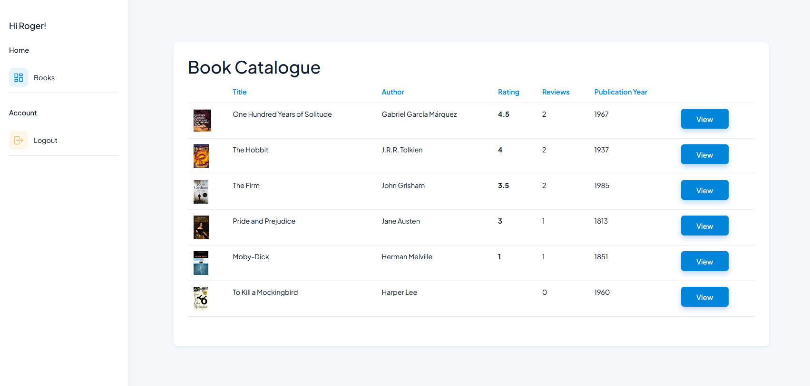

## Introduction

The purpose of this project was to solidify my grasp of ASP.NET Core and Entity Framework Core after completing a course. It's a book inventory management system that incorporates identity and permissions - the UI shown and the actions available to users depend on their associated user role. It interacts with a local SQL database and performs CRUD operations for books, book reviews and users.

## Access Levels

There are four access levels, which control what users can do in the system:

- **Anonymous**: a user who isn't logged in can view the catalogue of books, and look at any book's details and reviews. They also have the option to login and to register.
- **Reader**: a Reader is a logged in user with no special privileges. In addition to viewing the books and book reviews, they can also leave their own reviews.
- **Librarian**: Librarians have additional privileges. They can add and delete books, and edit the details. They can also delete (but not edit) other people's book reviews.
- **Administrator**: Administrators can do all of the above and also view users, edit their details and access level, and also delete them if need be.

## Demonstrating the project

This is a tricky project to demonstrate, because a lot of the functionality is hidden if you're not a Librarian or Administrator. To fully appreciate it you need to log in and out at different access levels to see the authentication in action. So to simplify the demonstration I'll include a series of screenshots here with commentary. (As opposed to deploying it on Azure and giving everyone administrator access!)

I'll follow this with a brief technical overview and then my thoughts on how the project could be taken further. The full code is here for anyone wanting to take a more detailed look at any aspect of the system.

## 1 - Anonymous Access

When the user is not logged in, these are the main two views: Book List and Book Details. The latter also shows any reviews for that book.

  
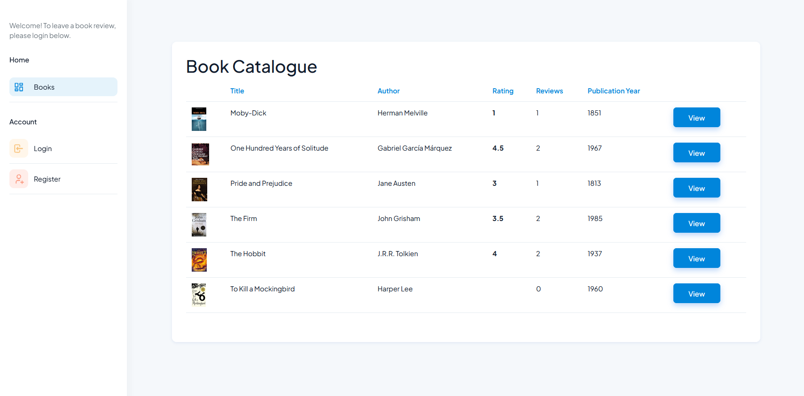
  
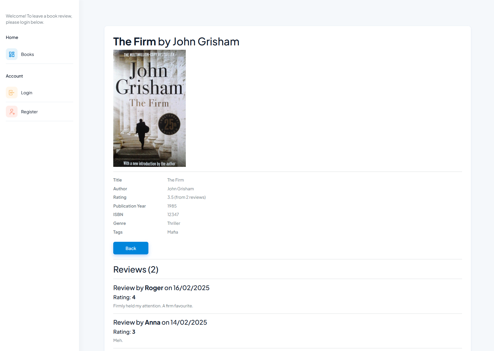
  

Note that the columns in the book list are sortable; by clicking on the column header it sorts the list as you would expect, so that, for example, you can list the top rated books first.

## 2 - Reader Access

Once the user has logged in, on any Book Details page they can leave a review. If they have previously left a review, that will be shown first, with the option to edit and/or delete it.

  
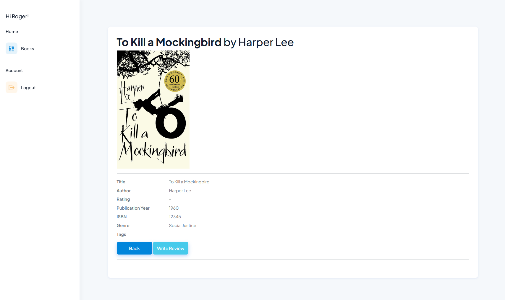
  
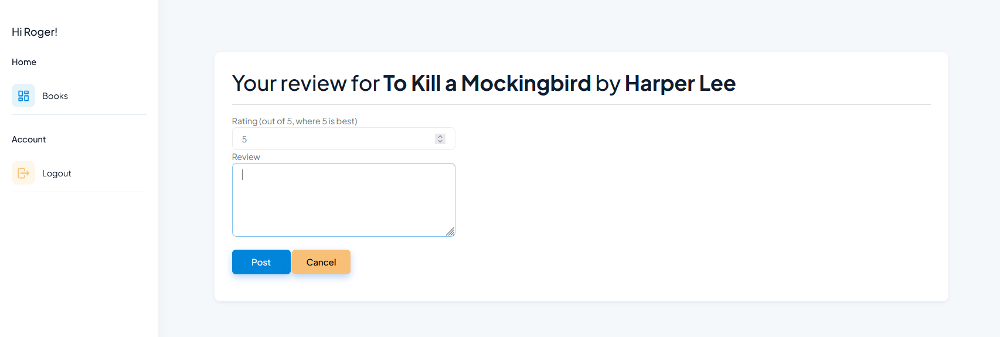
  
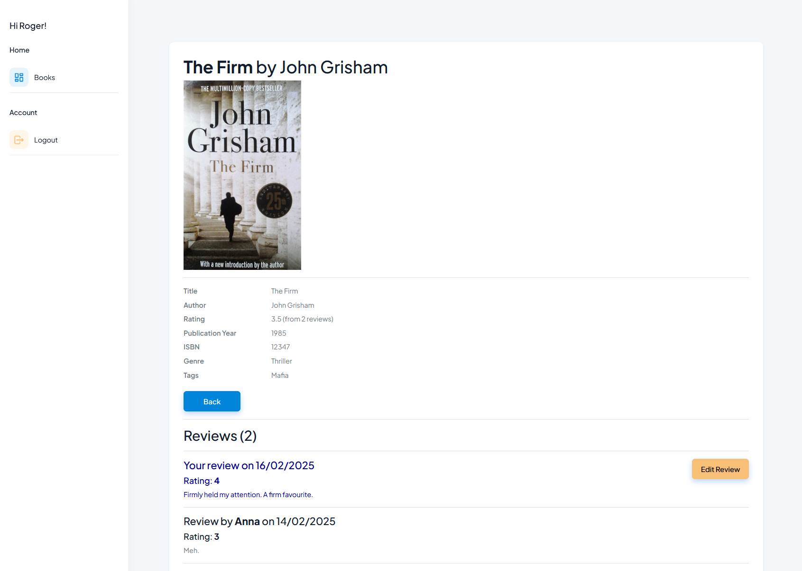
  

## 3 - Librarian Access

Librarians gain the ability to add, edit and delete books, not just reviews. They can also delete other people's reviews.

  
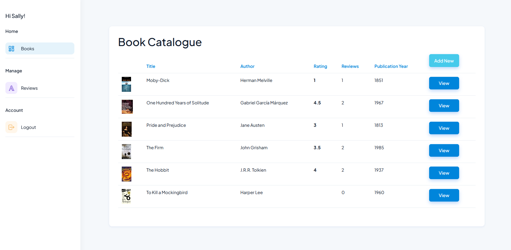
  
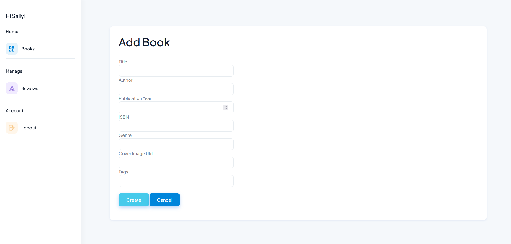
  
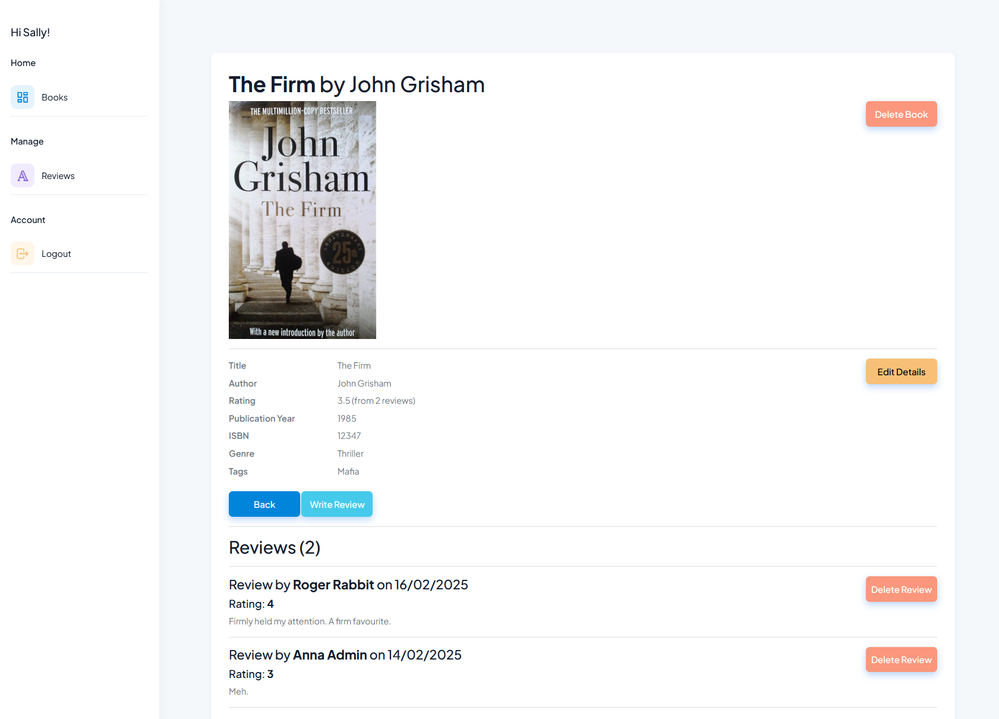
  
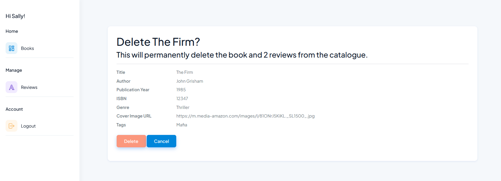
  
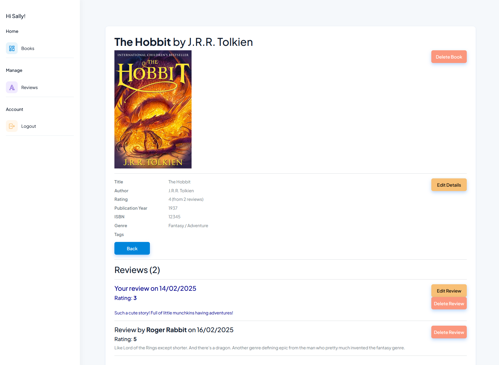
  
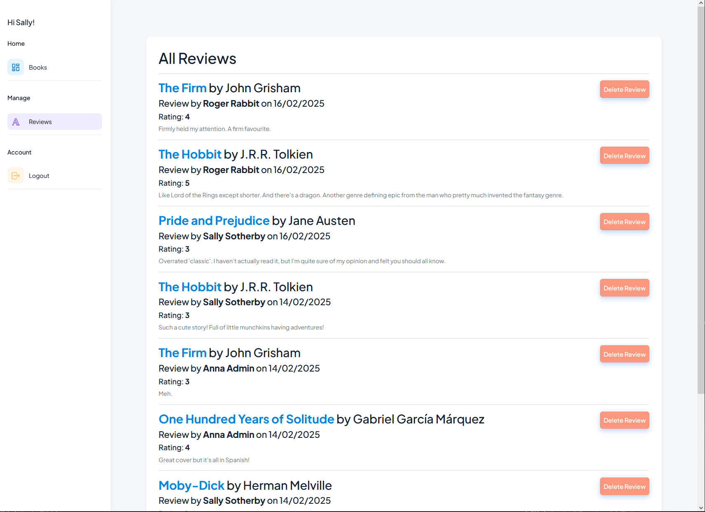
  

## 4 - Administrator Access

Administrators can do all of the above and add, edit and delete users too.

  
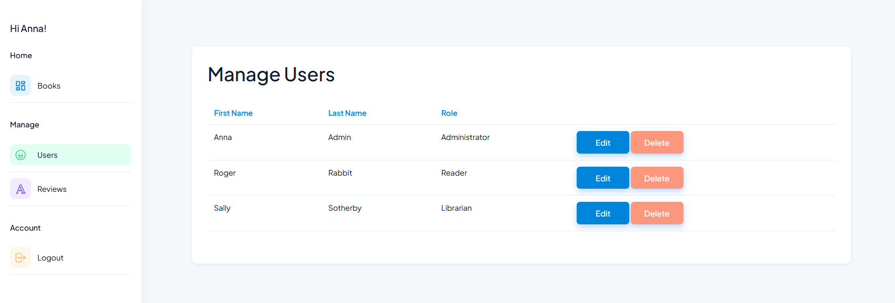
  

## Technical Overview

ASP.NET Core is capable of creating a 'Minimal API' for simpler web applications, but for this project I wanted to create a full MVC app, with Models, Views and Controllers. When starting the project I chose to incorporate identity and then a lot of the authorisation and authentication code was scaffolded for me, meaning I didn't have to write the user registration and login code from scratch.

### Code First Design

The project design was 'code first', meaning that the entity classes (Book and Review) are defined as C# objects and then Entity Framework Core uses those to automatically create the SQL database schema and translate the entity class properties into database tables and columns. This is done with 'migrations', where EF Core detects changes to the entity classes and updates the database accordingly when told to do so.

For example, I realised my reviews had no 'Created' date field. So I added that to the Review data class, got it to generate a migration, and pushed that to the database to add that column in the corresponding Review table.

### Separation of Concerns

I created a Books controller, a Reviews controller and a Users controller, each with corresponding CRUD views. To keep the controllers thin, I separated most of the business logic out into services, one for each controller, which are then accessed via dependency injection. There is also a BooksReviewsSharedController, created to avoid circular dependencies when the BooksService needs data from the ReviewsService and vice versa.

### Validation and Security

View models are used throughout, as DTOs passed between the controllers and the views, ensuring that only the necessary fields are ever accessible by the user, and to guard against overposting and underposting attacks.

Validation is performed on the various input fields. For example, if you create a review and leave the review text blank or add a rating that isn't in the range 1-5, the validation will fail and show a message accordingly. Only when the input validation passes will the CRUD operations be performed.

Controller actions have authorisation data annotations for further security. For example, to edit or delete a user, you need to have Administrator access, and the relevant controller actions have this constraint. So even if a lower-level user guessed the URL for deleting a book or a user, the application would refuse to perform the operation.

### User Interface

I only put a minimum of work into the user interface, because that wasn't the focus on this project, but I did apply a third party theme to improve the look and feel beyond the ASP.NET Core defaults. This was a free theme from WrapPixel called Spike Admin. Integrating it was mostly just a matter of melding elements into the \_Layout.cshtml file, which is applied to every page of the application. That turned the default nav bar into a more attractive sidebar with icons that I could then customise.

## Future Development

There are many ways this project could be fleshed out, made more robust and taken further if it was actually to be used.

### Testing

The system has only had minimal testing with the very basic test data you see in the screenshots. The point of the project was to get comfortable with building a MVC application, not to build a full production-ready system. So an obvious next step if developing it further would be to test it with a lot more data. As an example of something that might break, I haven't tested it with long reviews. To be really thorough, unit tests could be written for a lot of the service layer logic.

I've tested the authorisation and authentication a bit, trying to simulate someone maliciously trying to perform operations beyond their access level, but not exhaustively, and this would be important in a production system. It would need a full security review with an awareness of the possible attacks - SQL injection, XSS, etc.

### Error Handling

Error handling in the system is currently almost non-existent. To do that properly was beyond the scope of this demo project, so the code is full of helpful TODO comments for whenever something unexpectedly returns null or fails for some other reason. There is no logging either, since in dev mode I have the luxury of Visual Studio to see what's going on. For a production-ready deployment, the system would obviously need much more comprehensive error handling with detailed information logged and a suitably concise version shown to the user.

### Optimisation and performance

There are several points where the database is queried sub-optimally. To become a production-ready large scale system, the data access code needs a full review. I suspect that a fair bit of optimisation could be done to minimise database queries.

### Additional Functionality

There are many ways the system could be extended, beyond just making the existing application more robust:

- Search: It would be nice to search for a book by title or author. This would ideally be done intelligently so that a partial match or a misspelling could still produce useful matches.
- Filtering: UI options could allow you to return, say, just books with a 5 star rating, or that were published in a particular decade, or in a particular genre. Similarly, the 'tags' field of a book is currently just a text (string) field, and there is no associated functionality. But it would be nice if for example you could filter the books to just show those with a 'mafia' tag, for example.
- Book Lists: Users could be allowed to create and share book lists, which themselves could have ratings by other users.
- Notification System: At the moment if a Librarian deletes someone's review, or if an Administrator deletes someone's user account, it's just gone from the system. It would be a more polished experience if the relevant user was notified, either with an email, or (if they still have an account), a notification when they next logged in. "Your review of XYZ was deleted for XYZ reason." So a whole notification system would be good (i.e. a little bell icon with a red number next to it). That would then open the door to further social interaction functionality, for example someone liking your book list, or commenting on your review.
- Affiliate Links: If monetisation was a goal, each book in the system could have an affiliate link to the relevant page on Amazon. This would be very easy to implement; it would just need an extra property in the Book entity class ('PurchaseLink'), pushed to the database via a migration, and a link or button added to the relevant views to encourage people to click it.
